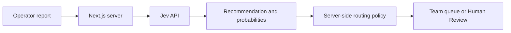

# Factory Dispatch

Factory Dispatch routes synthetic manufacturing incident reports to **Maintenance**, **Quality**, **Logistics**, or **Human Review** using TypeSafe AI’s Jev API.

Jev recommends a team and returns confidence and option probabilities. A separate server-side policy decides whether to use that recommendation or send the report for human review. The dashboard shows both decisions and the reason for the final routing.

The application runs on your machine and calls the hosted Jev API using your own key. There is no publicly hosted version of Factory Dispatch.

## How it works



The question asks **which team should assess the incident first**, not what caused the problem.

For example, a machine that unexpectedly stops can go to Maintenance even when the cause is unknown. A working machine waiting for missing materials goes to Logistics.

Question definitions live in [`src/lib/team-question.ts`](src/lib/team-question.ts). The application and evaluation runner use the same definitions.

### Routing policy

The policy in [`src/lib/routing.ts`](src/lib/routing.ts) applies these rules in order:

| Condition | Final destination |
| --- | --- |
| Jev selects `human_review` | Human Review |
| Jev selects another team with confidence below `0.70` | Human Review |
| Jev selects another team with confidence at or above `0.70` | Recommended team |

The **70% threshold is an unvalidated demo setting**, not a proven safety threshold.

The original recommendation, confidence, and probabilities are preserved. Human Review cards distinguish between **Model requested review** and **Below threshold**.

Confidence is not accuracy. A high-confidence answer can still be wrong.

Provider failures and invalid responses remain errors. They are never converted into successful routing decisions.

## Getting started

### Requirements

- Node.js compatible with the Next.js version in `package.json`
- npm
- A TypeSafe API key with access to Jev

Development and verification were performed with Node.js 26 and npm 11.

### Install

```bash
git clone https://github.com/gokhankrbg/factory-dispatch.git
cd factory-dispatch
npm ci
```

### Configure

Copy the environment template:

```bash
cp .env.example .env.local
```

Add your own key to `.env.local`:

```dotenv
TYPESAFE_API_KEY=your-key-here
TYPESAFE_MODEL=jev-latest
```

The API key is used only by the server-side integration. Do not prefix it with `NEXT_PUBLIC_` or include it in client-side code.

`.env.local` is ignored by Git and must not be committed. `.env.example` contains the blank-key template.

### Run

```bash
npm run dev
```

Open [localhost:3000](http://localhost:3000).

Each analysis makes a real Jev API request and consumes quota on your TypeSafe account. If you change the environment configuration, restart the development server.

## Using the dashboard

### Manual analysis

Enter an operator report or select an example, then click **Analyze incident**.

The result shows:

- The report that was analyzed
- Model recommendation and confidence
- Probabilities for all four destinations
- Final routing and the policy explanation
- Applied review threshold
- Returned model identifier
- API round-trip time

Click a queue card or activity entry to inspect a previous result. Selecting an incident does not make another API request.

### Live demo

**Run live demo** processes eight synthetic reports through the real API, one at a time. Outcomes are not hardcoded.

The reports include equipment faults, quality issues, material shortages, vague reports, and a mixed-signal case involving label defects and unusual printer noise.

The pacing control sets the pause between completed results:

| Mode | Pause |
| --- | --- |
| Presentation | 5 seconds |
| Fast | 300 milliseconds |

Results appear as soon as responses arrive. Presentation pauses are excluded from API timing.

**Stop demo** prevents further requests. If a request is already in progress, it finishes and its result is recorded once. A failed request halts the demo without creating a successful incident card.

### Presentation view

Presentation view provides a recording layout with:

- A compact explanation of the processing flow
- Live-demo controls and session metrics
- Decision details and team queues
- Review-reason badges

The manual form and activity log are hidden in this view. Switching views preserves the session and does not trigger analysis.

### Session metrics

The dashboard calculates analyzed incidents, automatic routing, review routing, and median API round-trip time from successful requests in the current session.

API round-trip measures the server’s request to Jev through receipt of the response body. It includes network and provider processing time. It is not pure model inference time or the full browser-to-browser response time.

Session data is stored in browser memory and resets on reload.

## Evaluation

The project includes 24 synthetic English reports:

- 12 development cases
- 12 holdout cases
- Three expected examples per destination in each group

The runner uses the same question definitions, response validation, timeout handling, and routing policy as the application.

With your API key configured, run either group:

```bash
npm run evaluate -- --group dev
```

```bash
npm run evaluate -- --group holdout
```

An explicit group is required. Each full run makes 12 real API requests, sequentially and without automatic retries.

Reports are saved as timestamped JSON and Markdown files in `evaluation/results/`. Routine outputs are ignored by Git. Authentication failures, missing configuration, and provider rate limits stop the run; partial results are saved where applicable.

### Recorded results

The reviewed runs below were recorded on **24 September 2026**, using **`jev-1.13.0`**, unchanged question definitions, and the `0.70` threshold.

| Metric | Development | Holdout |
| --- | --- | --- |
| Successful requests | 12/12 | 12/12 |
| Model-choice agreement with expected labels | 12/12 | 12/12 |
| Automatically routed | 9/12 | 9/12 |
| Sent to Human Review | 3/12 | 3/12 |
| Final-team agreement among automatically routed cases | 9/9 | 9/9 |
| Expected-review cases incorrectly auto-routed | 0/3 | 0/3 |
| Median API round-trip | 244 ms | 298 ms |
| Nearest-rank p95 API round-trip | 841 ms | 795 ms |

All six Human Review outcomes in these two runs were selected directly by the model. **The confidence-threshold fallback did not trigger in either evaluation run.**

These are small synthetic smoke evaluations, not estimates of production accuracy or stable latency benchmarks. Expected labels are provisional, human-reviewable expectations. Demo-session measurements are separate from these evaluation results.

Development cases may inform changes to the criteria or threshold. Keep holdout cases unchanged during tuning. Once holdout results inform a change, they are no longer an untouched final check.

See:

- [Evaluation methodology and results](docs/evaluation.md)
- [Reviewed JSON evidence](docs/evaluation-evidence/)
- [Dataset and metric definitions](evaluation/README.md)

## Development checks

```bash
npm run lint
npm run test
npm run build
```

Automated tests use mocked or synthetic responses without live API calls. They cover input and response validation, provider errors, routing rules, demo sequencing and stopping, session state, presentation controls, and evaluation metrics.

## Limitations

- **Synthetic data:** The reports are examples, not real production incidents. The evaluation is not industrial validation.
- **Uncertainty:** Confidence does not guarantee correctness. Human Review does not catch every incorrect decision.
- **Routing scope:** Human Review is a destination for cases that should not receive an automatic team assignment. It is not an emergency or severity classification.
- **No equipment control:** The application does not monitor or control machinery.
- **No persistence:** There is no database. Reloading clears the session.
- **Local use:** The API route has no authentication, rate limiting, or usage cap. Do not expose the application publicly as configured.
- **Model versioning:** `jev-latest` can resolve to a different model over time. Recorded evaluations include the actual returned version.

## References

- [TypeSafe documentation](https://docs.typesafe.ai/introduction)
- [Choice questions](https://docs.typesafe.ai/primitives/choice)
- [Confidence](https://docs.typesafe.ai/confidence)
- [API reference](https://docs.typesafe.ai/api)

## License

[MIT](LICENSE). Copyright (c) 2026 gokhankrbg.
