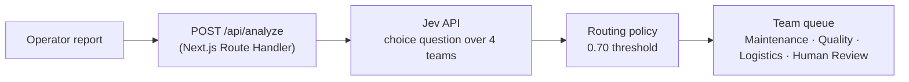

# Factory Dispatch

Factory Dispatch is a small English-language demo that routes synthetic
manufacturing incident reports to the team that should assess them
first — Maintenance, Quality, Logistics, or Human Review — using real
calls to TypeSafe AI's Jev API. It runs entirely locally, against your
own API key; there is no hosted deployment.

An operator's free-text report is sent to Jev's `choice` primitive,
which returns a **model recommendation** (a team, a confidence score,
and a full probability breakdown). A separate, deterministic,
server-side policy then decides the **final routing** applied to that
recommendation. The UI always shows both, plus a short explanation of
why they differ when they do.

## Routing policy

The question and team criteria live in one place
(`src/lib/team-question.ts`), shared by the live app and the evaluation
runner. It asks which team should **first assess** an incident, not
which team will ultimately diagnose the root cause — an equipment
symptom with an unknown cause still routes to Maintenance, not Human
Review.

`src/lib/routing.ts` then applies a small, pure policy on the server, in
this order:

1. If the model's own choice is `human_review`, the final team is
   Human Review — a **model-selected review**.
2. Otherwise, if confidence is below `REVIEW_CONFIDENCE_THRESHOLD`
   (**0.70** — confidence exactly at the threshold still routes
   directly), the final team is Human Review — a **below-threshold
   review**.
3. Otherwise, the final team is the model's recommended team, applied
   directly.

**The 0.70 threshold is an initial, unvalidated demo setting, not a
proven safety threshold.** The model's original recommendation,
confidence, and full probabilities are always preserved alongside the
final routing decision. Provider errors and malformed upstream
responses remain errors — they are never turned into a fabricated
successful Human Review result.

## How it works



The API key is read only on the server (`src/lib/jev.ts`, used by
`src/app/api/analyze/route.ts`) and is never prefixed with
`NEXT_PUBLIC_`, so it is never sent to the browser.

## Setup

Prerequisites: Node.js 20+ and npm (developed and tested with Node.js
v26 and npm 11).

```bash
git clone https://github.com/gokhankrbg/factory-dispatch.git
cd factory-dispatch
npm ci
```

Copy the environment template and add your own TypeSafe API key:

```bash
cp .env.example .env.local
```

```
TYPESAFE_API_KEY=your-key-here
TYPESAFE_MODEL=jev-latest
```

`.env.local` is git-ignored and must never be committed; `.env.example`
stays tracked as the blank-key template.

```bash
npm run dev
```

Open [http://localhost:3000](http://localhost:3000). This is a **local,
single-user demo** — there is no hosted instance, no authentication, and
no usage limiting in front of `/api/analyze`; every request (manual or
via the live demo) spends real Jev API quota on your key.

## Checks

```bash
npm run lint
npm run test
npm run build
```

Automated tests (mocked/synthetic data only — no live network access)
cover: input validation before calling Jev, successful response
mapping, malformed/inconsistent upstream responses being rejected
rather than papered over, provider authentication and rate-limit
failures, upstream timeout handling, the routing policy, the live-demo
sequencer (no overlapping requests, stop mid-flight or mid-pause,
failure halts the run, an explicit rerun resubmits everything), the
incident state reducer (one success always yields exactly one
incident), session metrics, the Presentation-view toggle (no fetch on
switch, session preserved, locked during an active request), and the
evaluation dataset/metrics/report code.

## Presentation view, live demo, and inspection

The dashboard has two views, switchable via an accessible toggle
(disabled while a request or demo is active — switching never triggers
a request or resets session data):

- **Normal view**: manual report form, live-demo controls, decision
  panel, team queues, and a collapsible activity log.
- **Presentation view**: built for recording — a static
  "Operator report → Jev assessment → Routing policy → Team queue"
  explanation strip, live-demo controls, session metrics, the decision
  panel, and team queues, with the manual form and activity log hidden
  and a collapsible "About this demo" disclosure for longer caveats.

**Run live demo** submits 8 fixed synthetic reports
(`src/lib/demo-fixture.ts` — report text and ids only, never imported
from the evaluation dataset or its expected labels) through the real
`/api/analyze` endpoint, one at a time, updating the UI the instant each
real response arrives. A **Pacing** control (editable only while idle)
sets the display-only pause between results — **Presentation** (5000 ms)
or **Fast** (300 ms) — which never affects the measured API latency.
**Stop demo** lets any in-flight request finish and record its result
once, or cancels an in-progress pause immediately; either way, no
further requests are scheduled, and the controls stay locked until
that settles. A failed request halts the demo without fabricating a
queue card; manual analysis is disabled while the demo runs, and only
one analysis request is ever in flight at a time.

Clicking any queue card or activity item selects that incident and
shows its full decision (report, model recommendation, final routing,
probabilities, threshold, model id, API round-trip time) — this never
makes a new request or changes session metrics. Human Review queue
cards show a compact badge for *why* — "Model requested review" or
"Below threshold" — derived from the actual stored routing reason, plus
the original model recommendation and confidence for below-threshold
cases. Not every Human Review outcome comes from a low-confidence
score: the model can select it directly.

## Evaluation

A 24-case English smoke-evaluation dataset (12 development + 12
holdout, 3 per team per group) lives in `evaluation/`. With
`TYPESAFE_API_KEY` set:

```bash
npm run evaluate -- --group dev
npm run evaluate -- --group holdout
```

An explicit `--group` is required. Each run makes real, sequential
requests against the TypeSafe API (no retries) — real API usage, same
as the live app — using the exact same question, response validation,
timeout, and routing policy as `/api/analyze`. It stops early, saving
partial results, on missing configuration, authentication failure, or a
provider rate limit. Results are written as a timestamped JSON + Markdown
report pair under `evaluation/results/` (git-ignored, never overwritten).

Development cases may inform later revisions to the question, criteria,
or threshold. Holdout cases must stay unchanged while tuning against the
development group — once a holdout run has informed a change, it's no
longer an untouched check. See `evaluation/README.md` for the dataset
and metric definitions, and **[`docs/evaluation.md`](docs/evaluation.md)
for one real, actual run of each group** with real values (dates, model
version, metrics with denominators, latency, and whether
confidence-threshold routing actually occurred).

## Limitations

- **Synthetic evaluation only.** The 24-case dataset is a smoke test
  for catching obvious regressions, not a statistically powered or
  industrially validated benchmark; expected labels are provisional,
  human-reviewable expectations, not verified ground truth.
- **Confidence is not accuracy.** A high-confidence recommendation is
  not a guarantee of correctness, and Human Review does not catch every
  incorrect decision — it's a routing destination, not a severity or
  emergency flag.
- **No equipment control.** This is a routing demonstration only; it
  does not read from, write to, or control any real equipment.
- **No persistence.** Session data (incidents, queues, metrics) lives
  in browser memory only and is lost on reload; there is no database.
- **No public API usage controls.** There is no rate limiting, usage
  capping, or authentication in front of `/api/analyze` — this project
  is meant to be run locally with your own key, not exposed publicly as
  configured today.

## License

MIT — see [LICENSE](LICENSE). Copyright (c) 2026 gokhankrbg.
